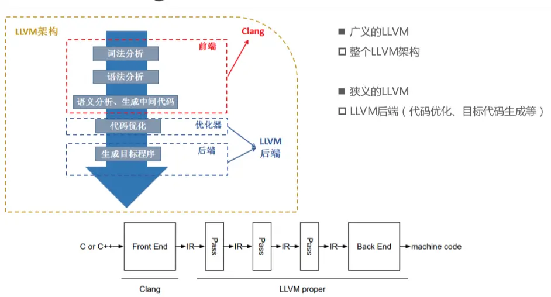
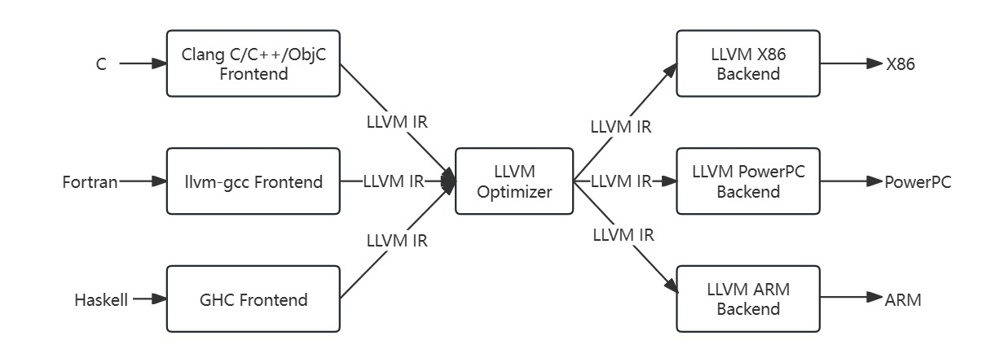
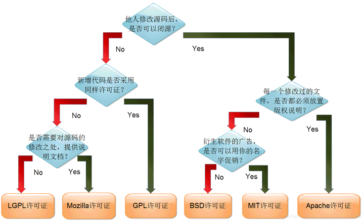

# 基于 LLVM-18 ，编写并使用 Pass

# 做这个视频的原因

- 首先本人不是专门搞编译器的，只是初入门软件安全
- 最近在看 AFLGo，涉及到了使用 LLVM 插桩
- 想自己实现插桩，但国内的相关教程和博客太难找了
- 基于这段时间找到的资料，结合写过的一些 pass，做个视频，为还在观望的同学做个介绍，展示用法，避掉几个坑，抛砖引玉
- 所以主要是面向和我一样的小白，有问题尽管提出意见和建议

# llvm 与 clang

LLVM 原本全称: low level virtual machine，因为作者原本只想写个虚拟机。但后面即使 LLVM 没成为虚拟机，但名称已经传开了。现在官方描述如下：`The name "LLVM" itself is not an acronym; it is the full name of the project`，即 `LLVM`这个名称本身不是首字母缩略词; 它是项目的全名$^{[1]}$。

LLVM 的结构展示如下。经常有人问到 clang 与 gcc 的区别，可以参考这篇文章: [clang 到底是什么？gcc 和 clang 到底有什么区别？](https://blog.csdn.net/qq_33919450/article/details/130911617)<br>
下图也可以看到本内容涉及到的核心：Pass，类似一个个`算子`，可以将传入的 IR 进行分析、转换，并输出新 IR。



LLVM 的特点$^{[1]}$：

1. 不同的前端后端使用统一的中间代码 LLVM Intermediate Representation (LLVM IR)。如果需要支持一种新的编程语言，只需实现一个新的前端。如果需要支持一种新的硬件设备，只需实现一个新的后端。扩展性强。
2. 代码模块化设计，易于理解，扩展性强。
3. 优化阶段针对的是统一的 LLVM IR，不论是支持新的编程语言，还是支持新的硬件设备，都不需要对优化阶段做修改。
4. [LLVM](https://github.com/llvm/llvm-project?tab=License-1-ov-file) 使用 Apache 许可证，[GCC](https://gcc.gnu.org/onlinedocs/libstdc++/manual/license.html) 使用 GPL 许可证。相比之下 LLVM 更宽松。
   

# 为什么使用 Pass

我们希望在不修改源码的情况下，在编译时通过遍历语法树或插入、修改代码的方式，收集程序数据，帮助了解程序的行为，便于发现潜在的错误或问题，最终增强程序的安全性。又或者进行代码混淆、改变逻辑、优化代码等操作。

# 可以使用 pass 的例子

- 代码分析：获取代码执行路径与覆盖率，
- 代码混淆：`a - b == (a + ~b) + 1`、`a + b == (((a ^ b) + 2 * (a & b)) * 39 + 23) * 151 + 111`，对于这两个等价的例子，将简单操作变为形式上复杂
- 逻辑修改：将两个浮点数的直接比较，修改为`两者之差在误差范围内即判断为相等`

# 安装

- 仓库地址：[https://github.com/llvm/llvm-project](https://github.com/llvm/llvm-project)
- 使用源码编译：[https://llvm.org/docs/GettingStarted.html#getting-the-source-code-and-building-llvm](https://llvm.org/docs/GettingStarted.html#getting-the-source-code-and-building-llvm)
- 使用官方提供的脚本：[https://apt.llvm.org](https://apt.llvm.org/)。注意这种安装方式，似乎所有的可执行文件都会带`-18` 后缀，可以自行添加软链接。
- 由于作者已经装了 llvm-14，我这里就使用装了 llvm-18 的 docker 镜像进行演示。具体的安装流程参考[Dockerfile](install/Dockerfile)。打包并运行镜像的流程如下。

  ```
  # 打包镜像，时间可能较长
  cd install && sudo docker build -t ubuntu22.04:llvm18 .
  # 启动并进入容器,挂载当前目录到容器内的/app目录，并在退出时删除容器
  #
  cd .. && sudo docker run -it --rm -v ./:/app ubuntu22.04:llvm18
  ```

  - 通过挂载目录的方式使用容器内的 llvm 编译宿主机上的代码。但该种方式不能让 宿主机上的 IDE 识别到 llvm 相关库文件，不方便调试，因此最好还是在主机上安装。

- 测试：可以进入`/usr/bin`下查看是否有 llvm 的一系列工具，也可以输入命令 `llvm-config-18 --version`看是否正确输出版本。

# 官方文档

- [User Guides](https://llvm.org/docs/UserGuides.html)
- [编写旧版 pass](https://llvm.org/docs/WritingAnLLVMPass.html)
- [编写新版 pass](https://llvm.org/docs/WritingAnLLVMNewPMPass.html)
- [编写新版 PassManager](https://llvm.org/docs/NewPassManager.html)
- [API 文档](https://llvm.org/doxygen/index.html)

# clang 初使用

参考 [clang-example 文件夹](experiment/clang-example/README.md)

# 旧版 pass(可选，主要还是用新版)

参考 [old-pass 文件夹](experiment/old-pass/README.md)

# 新版 pass

## 编译时分析代码

参考 [StaticCallCounter 文件夹](experiment/StaticCallCounter/README.md)

## 编译时修改逻辑

参考 [ChangeOperator 文件夹](ChangeOperator/README.md)

## 插入运行时收集数据的指令

参考 [DynamicCallCounter 文件夹](DynamicCallCounter/README.md)

## 使用 cmake

虽然网上的教程基本全是用 cmake 构建 pass。但本人不太会写 CMakeLists 的配置，故本项目不涉及 cmake<br>
可以参考 [Building LLVM with CMake](https://llvm.org/docs/CMake.html) 和 [LLVM：从零开始实现 Function Pass](https://www.less-bug.com/posts/llvm-implement-function-pass-from-scratch/)

# 使用自带的 pass

- `opt -print-passes`打印当前可用的 pass。也可在官网查看未及时更新的 pass 列表：[LLVM’s Analysis and Transform Passes](https://llvm.org/docs/Passes.html)

- 打印使用到的 pass

# 常见问题

## 主要的 option

4. 使用 clang 时接收参数

通过 Clang 调试 Pass 时，需要使能 LLVM 的 DEBUG()宏，Clang 控制 LLVM 的参数，前面都需要加“-mllvm”：

- mllvm cl:opt
- load
- -c
- -S
- -g
- --load-pass-plugin=./test.so，注意文件路径
- -Xclang
- -disable-O0-optnone
- -disable-output: is used to prevent opt from printing the output bitcode file.
- -fpIC
- `llvm-config --cxxflags`
- -emit-llvm
- -shared

## IR 学习

网上资料不少，自行查找

## isRequired()

> [Overview of The Passes](https://github.com/banach-space/llvm-tutor/blob/main/README.md#overview-of-the-passes)

关于在 pass 中还要额外 overide 一个 isRequired() 方法：<br>
Note that clang adds the optnone function attribute if either

- no optimization level is specified, or -O0 is specified.
- If you want to compile at -O0, you need to specify -O0 -Xclang -disable-O0-optnone or define a static isRequired method in your pass. Alternatively, you can specify -O1 or higher. Otherwise the new pass manager will register the pass but your pass will not be executed.

## 关于 PassInfoMixin 和 AnalysisInfoMixin

> [Analysis vs Transformation Pass](https://github.com/banach-space/llvm-tutor/blob/main/README.md#analysis-vs-transformation-pass)

a transformation pass will normally inherit from PassInfoMixin,
an analysis pass will inherit from AnalysisInfoMixin.<br>
This is one of the key characteristics of the New Pass Managers - it makes the split into Analysis and Transformation passes very explicit.

## 返回值

对于 pass 的返回值，旧版是`return 修改了 IR? true:false`，新版是`return 修改了IR? PreservedAnalyses::none():PreservedAnalyses::all()`。<br>
可以参考：[LLVM 学习笔记 - Using the New Pass Manager](https://blog.csdn.net/qq_43688320/article/details/136121107)

# 难点

- 注册有很多种 API，令人疑惑
- 进行动态插入指令时需要了解 IR 指令和相关 API
- 很多更深的内容，就需要学习 LLVM 的源码了

# 推荐资料

[helpful LLVM resources ](https://github.com/banach-space/llvm-tutor/blob/main/README.md#references)

# 参考

这里有些是提出解决方案的博客，有些提供了代码参考，有些是更深入的源码剖析

1. [深入浅出让你理解什么是 LLVM](https://www.jianshu.com/p/1367dad95445)
2. [使用 LLVM+Clang13 进行代码插桩的简单示例](https://www.bilibili.com/video/BV16V4y1n7Mz/?spm_id_from=333.337.search-card.all.click&vd_source=43b6af819307ca6bdad60477a02d8d1c)
3. [clang 到底是什么？gcc 和 clang 到底有什么区别？](https://blog.csdn.net/qq_33919450/article/details/130911617)
4. [从零开始的 LLVM18 教程（一）](https://zhuanlan.zhihu.com/p/670338052)
5. [How to automatically register and load modern Pass in Clang?](https://stackoverflow.com/questions/54447985/how-to-automatically-register-and-load-modern-pass-in-clang/75999804#75999804)
6. [Windows 下优雅使用 LLVMPass](http://www.qfrost.com/posts/llvm/llvmwindows%E4%B8%8B%E4%BC%98%E9%9B%85%E4%BD%BF%E7%94%A8llvmpass/)
7. [LLVM PassManager 对 C++程序设计的思考](https://zhuanlan.zhihu.com/p/338837812)
8. [How to load pass plugin in new pass manager?](https://stackoverflow.com/questions/76848689/how-to-load-pass-plugin-in-new-pass-manager)
9. [LLVM——LLVMHello](https://xia0ji233.pro/2024/01/21/LLVM2/index.html)
10. [llvm NewPassManager API 分析及适配方案](https://leadroyal.cn/p/2210/)
11. [LLVM’s Analysis and Transform Passes](https://llvm.org/docs/Passes.html)
12. [Adding Passes to a Pass Manager](https://llvm.org/docs/NewPassManager.html#adding-passes-to-a-pass-manager)
13. [LLVM 中的 pass 及其管理机制](https://zhuanlan.zhihu.com/p/290946850)
14. [第 9 章: 使用 PassManager 和 AnalysisManager](https://zhqli.com/post/1665878400)
15. [LLVM 入门教程之基本介绍](https://blog.yuuoniy.cn/posts/llvm-1/)
16. [LLVM doesn't generate CFG](https://stackoverflow.com/questions/67393329/llvm-doesnt-generate-cfg)
